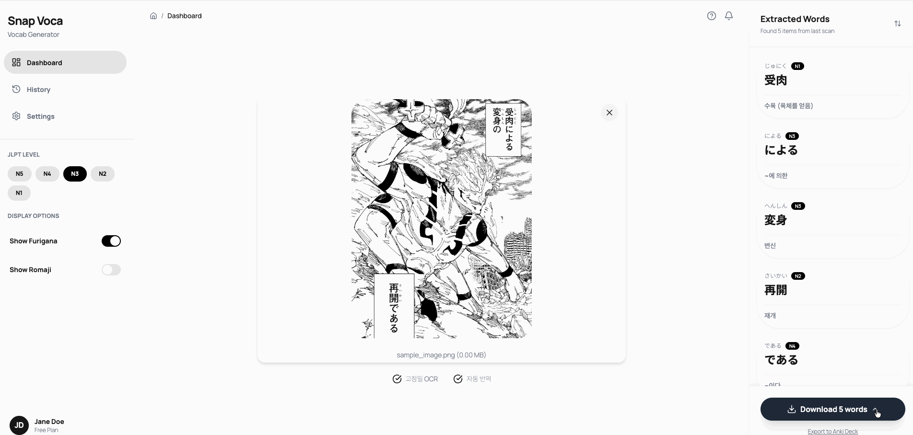
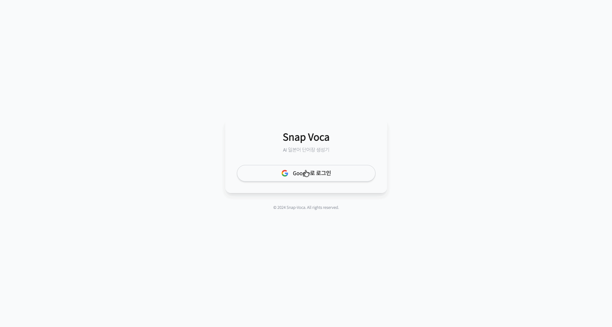

# 📸 Snap-Voca (AI 단어장 생성기)

이미지에서 일본어 단어를 추출하여 한국어 번역과 발음(후리가나)이 포함된 단어장을 자동으로 생성합니다.

| Type             | Link                                                              |
| :--------------- | :---------------------------------------------------------------- |
| **🚀 Live Demo** | [**배포 사이트 바로가기**](https://ai-vocab-generator.vercel.app) |
| 📂 GitHub        | [소스 코드 보기](https://github.com/als982001/ai-vocab-generator) |
| 📝 Tech Blog     | [개발 과정 회고 (Velog/Tistory)](https://jmjjjmj.tistory.com/)    |

## 🛠 Tech Stack

- **Framework:** React 19 + Vite 7
- **Routing:** React Router 7
- **Language:** TypeScript
- **Styling:** Tailwind CSS
- **Backend:** Supabase (Auth + PostgreSQL)
- **Server State:** TanStack Query (React Query)
- **AI:** Google Gemini 2.5 Flash API
- **UI Libraries:** Lucide React, Sonner (Toast), React Dropzone, Framer Motion
- **Other:** Web Speech API (TTS)

## ✨ Features

### 📤 메인 페이지 (`/`)

이미지에서 일본어 단어를 추출하여 단어장을 생성합니다.

  
    
  

- **Drag & Drop 업로드**: 이미지를 드래그앤드롭으로 간편하게 업로드
- **AI 단어 추출**: Google Gemini API를 통해 이미지 속 일본어 단어 자동 인식
- **JLPT 레벨 표시**: 각 단어의 난이도 레벨 (N5~N1) 자동 판별
- **후리가나 지원**: 일본어 발음(읽는 법) 제공
- **데이터 내보내기**: 추출된 단어장을 TXT 또는 CSV 파일로 다운로드

#### v0.2.0 ~ v0.3.0 추가 기능

  
  &nbsp;&nbsp;
  

- **바운딩 박스 표시**: 추출된 단어의 위치를 이미지 위에 박스로 표시
- **단어 상호작용**: 이미지 내 박스 클릭 시 해당 단어 카드로 자동 스크롤
- **모바일 반응형 지원**: 모바일 화면에 최적화된 레이아웃 제공
- **CSV 다운로드**: Anki 및 엑셀 호환을 위한 CSV 포맷 지원 (UTF-8 BOM 적용)

### 📚 히스토리 페이지 (`/history`)

과거에 분석한 모든 단어를 카드 형태로 확인하고 관리합니다.

  

**모바일 히스토리 UI (v0.3.0)**

  

- **반응형 리스트 뷰**: 데스크톱(Grid) ↔ 모바일(Stack) 자동 전환 레이아웃
- **모바일 최적화**: 햄버거 메뉴, 플로팅 액션 버튼(FAB) 등 모바일 전용 UI 적용
- **정렬 기능**: 최신순, 오래된순, 난이도순(N5→N1, N1→N5) 정렬
- **검색 기능**: 단어/뜻 키워드 검색
- **필터 기능**: 연도별, JLPT 레벨별 다중 선택 필터링
- **단어 편집/삭제**: 뜻 수정 및 불필요한 단어 삭제 (실행 취소 지원)
- **발음 듣기**: TTS(Text-to-Speech)로 일본어 발음 청취

## 🔧 주요 구현 사항

### 1. Supabase 기반 데이터 영속화 (localStorage → Supabase 마이그레이션)

- **클라우드 저장**: 기존 localStorage 방식에서 Supabase PostgreSQL로 마이그레이션하여 기기/브라우저 변경 시에도 데이터 유지
- **테이블 설계**: `analyses`(분석 결과) + `words`(추출 단어) 2개 테이블로 정규화, `words.user_id` 비정규화를 통해 JOIN 없이 빠른 조회 가능
- **RLS (Row Level Security)**: 유저별 데이터 격리를 DB 레벨에서 보장하여 다른 유저의 데이터 접근 원천 차단
- **서비스 레이어 분리**: `analysis.ts`에서 Supabase CRUD 로직을 캡슐화하여 페이지 컴포넌트와 데이터 접근 계층 분리
- **실행 취소 기능**: Sonner Toast의 `action` 속성을 활용해 삭제/수정 작업 즉시 복구 가능

### 2. 성능 최적화

- **`useMemo`를 활용한 필터링/정렬**: history-page.tsx
  - 대량의 단어 카드 렌더링 시 불필요한 재계산 방지
  - 정렬(최신순/오래된순/난이도순)과 필터(연도/레벨)를 메모이제이션하여 성능 개선

### 3. UX 강화

- **TTS 음성 듣기**: Web Speech API를 활용한 일본어 발음 재생
- **즉각적인 피드백**: Sonner를 통한 토스트 알림으로 모든 데이터 조작에 실시간 피드백 제공
- **다운로드 옵션 제공**: Radix UI 기반 드롭다운 메뉴를 통해 TXT/CSV 포맷 선택 가능
- **애니메이션 & 마이크로 인터랙션**: Framer Motion 기반 카드 순차 등장(stagger), 페이지 전환, hover/active 피드백 등 세밀한 인터랙션 적용

### 4. AI 이미지 분석 & 시각화

- **Google Gemini 2.5 Flash API** 연동: OCR + 번역 + 레벨 판정을 한 번의 API 호출로 처리
- **좌표 기반 오버레이**: AI 응답에서 단어 좌표를 받아 이미지 위에 바운딩 박스 렌더링
- **반응형 좌표 계산**: 창 크기 변경 시에도 박스 위치가 정확하게 유지되도록 구현

### 5. 모바일 반응형 아키텍처 (v0.3.0)

- **Layout Shift 방지**: Tailwind CSS Breakpoint(`md:`)를 활용하여 JS 개입 없이 CSS 레벨에서 레이아웃 전환
- **모바일 전용 컴포넌트**:
  - `Sheet` (Drawer): 모바일에서 사이드바 메뉴를 대체하는 드로어 구현
  - `FloatingActionButton`: 모바일 환경에서 주요 기능(업로드/다운로드) 접근성 강화

### 6. 데이터 내보내기 고도화 (CSV)

- **인코딩 처리**: 엑셀(Excel)에서 한글/일본어 깨짐 방지를 위해 **UTF-8 BOM(\uFEFF)** 적용
- **데이터 무결성**: 쉼표(`,`)나 줄바꿈이 포함된 텍스트가 셀을 깨뜨리지 않도록 이스케이프 처리 구현
- **Anki 호환성**: 암기 앱(Anki)에서 즉시 가져올 수 있는 포맷 표준 준수

### 7. Google OAuth 인증

  

- **Supabase Auth 연동**: Google OAuth 2.0을 통한 소셜 로그인 구현
- **AuthContext**: `onAuthStateChange`로 세션 변화 감지, `getSession()`으로 기존 세션 복원
- **라우트 보호**: `ProtectedLayout`을 통해 미인증 유저는 `/login`으로 리다이렉트, 인증된 유저가 `/login` 접근 시 `/`로 리다이렉트
- **유저 프로필 표시**: 사이드바에 Google 프로필 이미지, 이름, 이메일 표시 및 로그아웃 기능

  

### 8. TanStack Query 서버 상태 관리

- **커스텀 훅 패턴**: `useAnalysisHistory`, `useSaveAnalysis`, `useWordMutations` 등 기능별 훅으로 분리
- **자동 캐싱**: 히스토리 페이지 재방문 시 API 재호출 없이 캐시된 데이터 즉시 표시
- **선언적 상태 관리**: `isLoading`, `isError` 등으로 로딩/에러 UI를 선언적으로 처리
- **자동 리페칭**: mutation 성공 시 `invalidateQueries`로 관련 데이터 자동 갱신

## 💡 기술적 의사결정

### CSV 생성을 클라이언트에서 처리한 이유

- **서버 부하 감소**: 별도의 백엔드 API 호출 없이 브라우저의 `Blob` 객체를 활용하여 즉시 파일 생성
- **보안**: 사용자 데이터가 서버를 거치지 않고 로컬에서 바로 파일로 변환됨

### words 테이블에 user_id를 비정규화한 이유

- **조회 성능**: "내 단어 전체 조회" 시 `analyses` JOIN 없이 `words` 테이블만으로 처리 가능
- **RLS 단순화**: Row Level Security 정책에서 서브쿼리 없이 `auth.uid() = user_id` 단순 비교로 접근 제어

## 🗺️ Roadmap

- [x] MVP: 일본어 → 한국어 단어장 생성
- [x] Drag & Drop 이미지 업로드
- [x] 단어 카드 UI 구현
- [x] 실제 AI API 연동 (Google Gemini)
- [x] 히스토리 관리 기능 (LocalStorage)
- [x] TTS 발음 듣기 기능
- [x] CSV / Anki 포맷 내보내기
- [x] 모바일 반응형 UI 완벽 지원
- [x] Google OAuth 로그인 (Supabase Auth)
- [x] 클라우드 데이터 저장 (localStorage → Supabase PostgreSQL)
- [x] TanStack Query 서버 상태 관리

## 📂 Directory Structure
