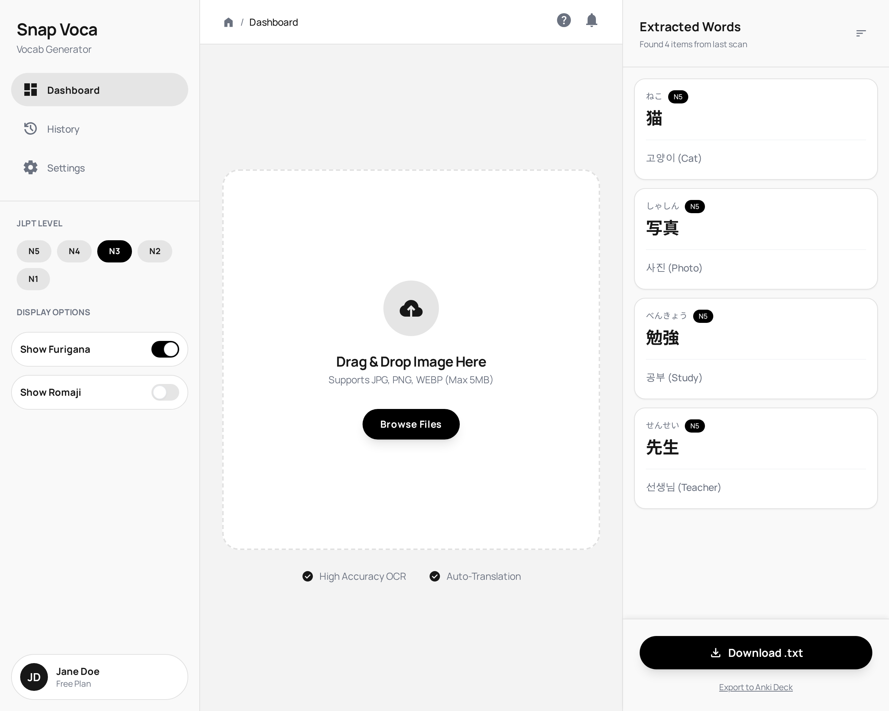

# 📸 Snap-Voca (AI 단어장 생성기)

이미지에서 일본어 단어를 추출하여 한국어 번역과 발음(후리가나)이 포함된 단어장을 자동으로 생성합니다.

## 🎨 Preview


_예상 완성 디자인_

## 🛠 Tech Stack

- **Framework:** React (Vite)
- **Language:** TypeScript
- **Styling:** Tailwind CSS
- **Icons:** Lucide React
- **Prototyping:** Stitch (Initial UI Composition)

## ✨ Features

- **Image Upload:** Drag & Drop을 통한 직관적인 이미지 업로드
- **OCR Analysis:** 이미지에서 일본어 단어 자동 추출
- **Translation:** 추출된 단어의 한국어 번역 및 영어 의미 제공
- **Furigana Support:** 일본어 발음(후리가나) 표시
- **Export:** 추출된 단어장을 .txt 파일로 다운로드

## 🗺️ Roadmap

- [x] MVP: 일본어 → 한국어 단어장 생성
- [x] Drag & Drop 이미지 업로드
- [ ] 단어 카드 UI 구현
- [ ] 실제 OCR API 연동 (Google Vision / Tesseract)
- [ ] 다국어 지원 (영어, 중국어 등)
- [ ] PDF 파일 업로드 지원
- [ ] Anki Deck 내보내기 기능

## 📂 Directory Structure

```
/src
├── components/      # UI 컴포넌트 (Presentational)
├── containers/      # 비즈니스 로직 (Container)
├── types/           # TypeScript 타입 정의
└── mockData.ts      # 테스트용 데이터
```
