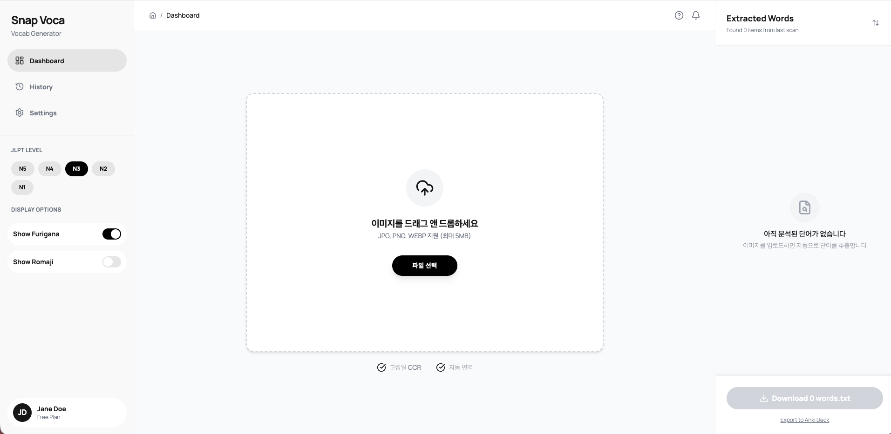
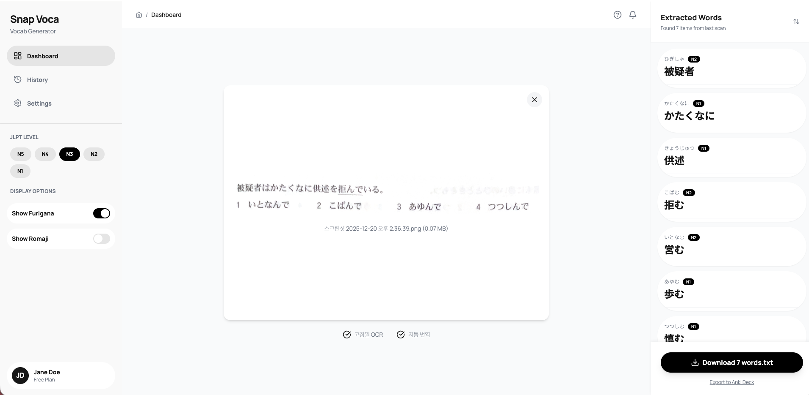
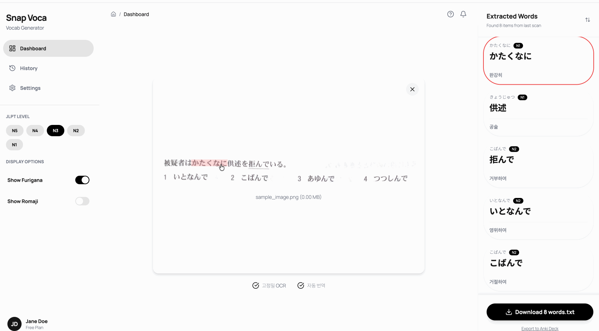
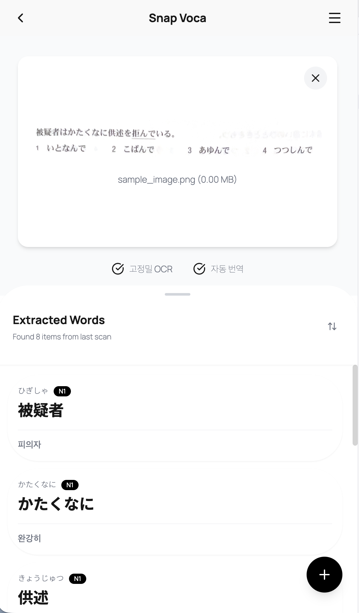
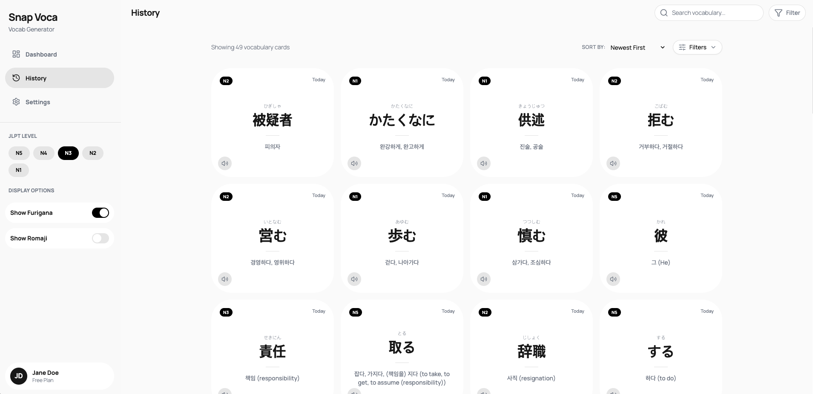
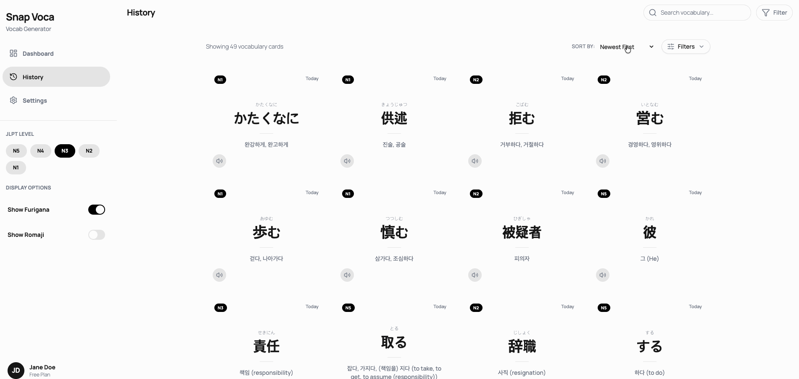

# 📸 Snap-Voca (AI 단어장 생성기)

이미지에서 일본어 단어를 추출하여 한국어 번역과 발음(후리가나)이 포함된 단어장을 자동으로 생성합니다.


| Type | Link |
| :--- | :--- |
| **🚀 Live Demo** | [**배포 사이트 바로가기**](https://ai-vocab-generator.vercel.app) |
| 📂 GitHub | [소스 코드 보기](https://github.com/als982001/ai-vocab-generator) |
| 📝 Tech Blog | [개발 과정 회고 (Velog/Tistory)](https://jmjjjmj.tistory.com/) |

## 🛠 Tech Stack

- **Framework:** React 19 + Vite 7
- **Routing:** React Router 7
- **Language:** TypeScript
- **Styling:** Tailwind CSS
- **AI:** Google Gemini 2.5 Flash API
- **UI Libraries:** Lucide React, Sonner (Toast), React Dropzone
- **Other:** Web Speech API (TTS)

## ✨ Features

### 📤 메인 페이지 (`/`)

이미지에서 일본어 단어를 추출하여 단어장을 생성합니다.

<div align="center">
  
  <br><br>
  
</div>

- **Drag & Drop 업로드**: 이미지를 드래그앤드롭으로 간편하게 업로드
- **AI 단어 추출**: Google Gemini API를 통해 이미지 속 일본어 단어 자동 인식
- **JLPT 레벨 표시**: 각 단어의 난이도 레벨 (N5~N1) 자동 판별
- **후리가나 지원**: 일본어 발음(읽는 법) 제공
- **TXT 내보내기**: 추출된 단어장을 텍스트 파일로 다운로드

#### v0.2.0 추가 기능

<div align="center">
  
  <br><br>
  
</div>

- **바운딩 박스 표시**: 추출된 단어의 위치를 이미지 위에 박스로 표시
- **단어 상호작용**: 이미지 내 박스 클릭 시 해당 단어 카드로 자동 스크롤
- **모바일 반응형 지원**: 모바일 화면에 최적화된 레이아웃 제공

### 📚 히스토리 페이지 (`/history`)

과거에 분석한 모든 단어를 카드 형태로 확인하고 관리합니다.

<div align="center">
  
</div>

**인터랙티브 기능 데모 (정렬 → 필터 → 수정 → 삭제)**

<div align="center">
  
</div>

- **단어 카드 뷰**: 분석한 모든 단어를 깔끔한 카드 UI로 표시
- **정렬 기능**: 최신순, 오래된순, 난이도순(N5→N1, N1→N5) 정렬
- **필터 기능**: 연도별, JLPT 레벨별 필터링
- **단어 편집**: 뜻과 레벨 수정 가능 (실행 취소 지원)
- **단어 삭제**: 불필요한 단어 삭제 (실행 취소 지원)
- **발음 듣기**: TTS(Text-to-Speech)로 일본어 발음 청취

## 🔧 주요 구현 사항 (2026.01.25 기준)

### 1. LocalStorage 기반 CRUD 구현

- **영구 저장**: 서버 없이도 브라우저에서 단어 데이터를 생성/읽기/수정/삭제할 수 있도록 구현
- **서비스 레이어 분리**: `localStorage.ts`에서 데이터 접근 로직을 캡슐화하여 추후 백엔드 마이그레이션 용이
- **실행 취소 기능**: Sonner Toast의 `action` 속성을 활용해 삭제/수정 작업 즉시 복구 가능

### 2. 성능 최적화

- **`useMemo`를 활용한 필터링/정렬**: history-page.tsx:260, 287
  - 대량의 단어 카드 렌더링 시 불필요한 재계산 방지
  - 정렬(최신순/오래된순/난이도순)과 필터(연도/레벨)를 메모이제이션하여 성능 개선

### 3. UX 강화

- **TTS 음성 듣기**: Web Speech API를 활용한 일본어 발음 재생
  - 별도 라이브러리 없이 브라우저 네이티브 기능 활용
  - 일본어 음성 자동 선택 및 재생 속도 조절 (0.8x)
- **즉각적인 피드백**: Sonner를 통한 토스트 알림으로 모든 데이터 조작에 실시간 피드백 제공
- **Drag & Drop**: react-dropzone으로 직관적인 이미지 업로드 경험 구현

### 4. AI 이미지 분석

- **Google Gemini 2.5 Flash API** 연동
  - 이미지에서 일본어 단어 자동 추출
  - 한국어 번역 + 후리가나 + JLPT 레벨까지 한 번에 생성
  - Vercel 서버리스 함수로 API 키 보안 처리 (프로덕션 환경)

### 5. 이미지 바운딩 박스 (v0.2.0)

- **좌표 기반 오버레이**: AI 응답에서 단어 좌표를 받아 이미지 위에 바운딩 박스 렌더링
- **반응형 좌표 계산**: 창 크기 변경 시에도 박스 위치가 정확하게 유지되도록 구현
- **양방향 상호작용**: 이미지 박스 ↔ 단어 카드 간 클릭 시 자동 스크롤

### 6. 모바일 반응형 레이아웃 (v0.2.0)

- **조건부 렌더링**: 화면 너비에 따라 데스크톱/모바일 레이아웃 자동 전환
- **모바일 전용 컴포넌트**: 플로팅 액션 버튼, 모바일 헤더, 사이드바 드로어 구현

## 💡 기술적 의사결정 (2026.01.04 기준)

### LocalStorage를 선택한 이유

- **MVP 우선**: 초기 단계에서 복잡한 백엔드 인증(Auth) 구현보다 핵심 기능(단어 카드 UX)에 집중
- **빠른 프로토타이핑**: 서버 구축 없이 클라이언트에서 완결되는 기능으로 빠른 검증 가능
- **마이그레이션 용이**: 서비스 레이어(`localStorage.ts`)로 데이터 접근 로직을 분리하여 추후 Supabase/Firebase 등으로 쉽게 전환 가능

### React Router 7을 선택한 이유

- **파일 기반 라우팅**: `routes.ts`에서 선언적으로 라우트 정의, 코드 가독성 향상
- **최신 React 생태계**: React 19와의 호환성 및 최신 패턴 적용

### Google Gemini API를 선택한 이유

- **올인원 처리**: Tesseract(OCR만) 대비 OCR + 번역 + 레벨 판정을 한 번의 API 호출로 처리
- **빠른 응답 속도**: Flash 모델 사용으로 평균 2-3초 내 결과 반환
- **한국어 번역 품질**: GPT-4V 대비 저렴한 비용으로 충분한 번역 품질 제공

### Web Speech API를 선택한 이유

- **Zero Dependency**: 별도 라이브러리나 서버 없이 브라우저 네이티브 기능 활용
- **충분한 품질**: 일본어 발음 학습용으로는 브라우저 기본 TTS 엔진도 충분히 자연스러움
- **즉시 사용 가능**: 추가 설정 없이 모든 모던 브라우저에서 즉시 작동

## 🗺️ Roadmap

- [x] MVP: 일본어 → 한국어 단어장 생성
- [x] Drag & Drop 이미지 업로드
- [x] 단어 카드 UI 구현
- [x] 실제 AI API 연동 (Google Gemini)
- [x] 히스토리 관리 기능 (LocalStorage)
- [x] TTS 발음 듣기 기능
- [ ] 다국어 지원 (영어, 중국어 등)
- [ ] PDF 파일 업로드 지원
- [ ] Anki Deck 내보내기 기능

## 📂 Directory Structure

```
/src
├── components/      # UI 컴포넌트 (Presentational)
├── containers/      # 비즈니스 로직 (Container)
├── types/           # TypeScript 타입 정의
└── mockData.ts      # 테스트용 데이터
```
